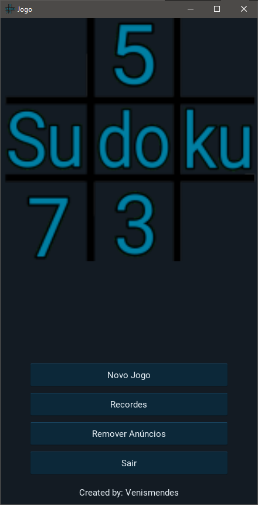
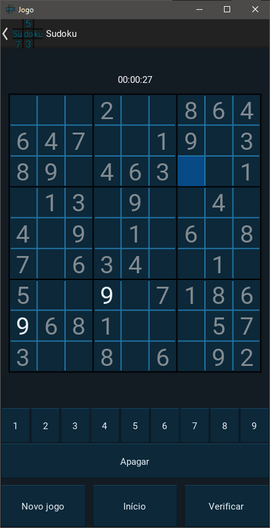

<h1 align = "center"><strong>Sudoku</strong></h1>

  

* Para usar o App bastar ter o **Python** e a biblioteca **Kivy** instalados, e executar o arquivo **main.py**

## Para conhecer mais sobre a API Kivy [clique aqui](https://kivy.org/#home)!!

Imagens do jogo:

  

Ferramentas usadas para o desenvolvimento desse app:

| Python | Kivy | Json |
|---     |---   |---|

* Autor/Desenvolvedor: **Venismendes** 
